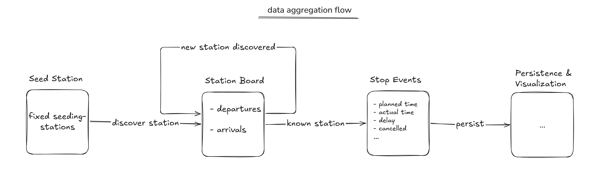
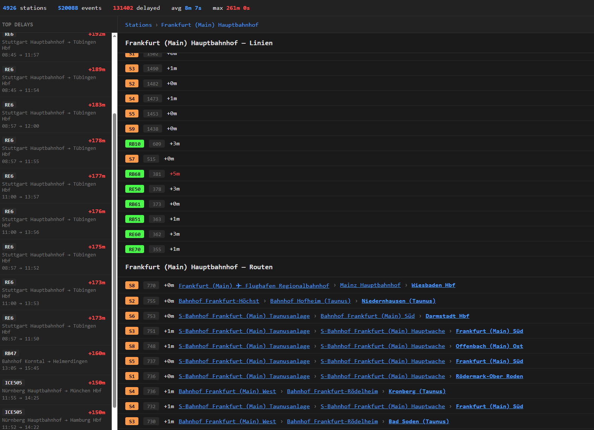
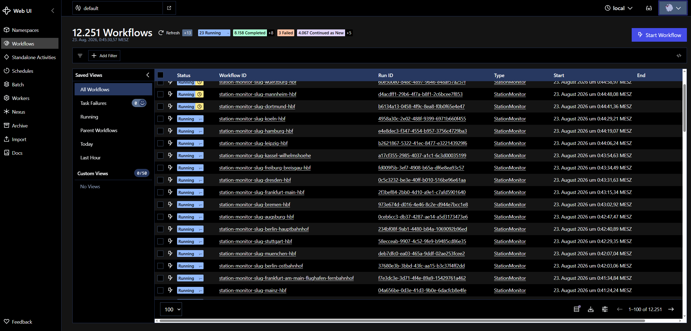

# verspaetet

Experimental project to aggregate a dataset of Deutsche Bahn delays at train stations.

verspaetet (German for "delayed") is a proof-of-concept that collects departure and arrival board data from Deutsche Bahn stations, persists raw delay datapoints to Postgres, and serves a web UI for monitoring. It uses Temporal to orchestrate station discovery and periodic monitoring workflows.

> **Note:** This is a POC built entirely with agentic code. The quality is rough and not production-ready.

## How it works

1. A seeder starts Temporal workflows for 23 seed stations (Fernverkehrsknoten)
2. **Discovery workflows** render each station's board, extract via/destination slugs, and spawn child workflows for unknown stations (up to depth 8)
3. **Monitor workflows** re-collect each station every 5 minutes in a ContinueAsNew loop, persisting delay data (planned vs. actual times, platform changes, cancellation status, delay reasons)
4. A Go API serves the data as JSON + a React UI



## Stack

- **Go** — workers, activities, API server
- **Temporal** — workflow orchestration (production server, Postgres persistence)
- **Postgres** — collected data + Temporal persistence
- **browserless/chrome** — headless rendering of station boards
- **React + Vite** — monitoring UI

## Run

```bash
cp .env.example .env   # set POSTGRES_PASSWORD and version pins
docker compose up -d
```

UIs:
- Monitor UI: `http://localhost:8080`
- Temporal UI: `http://localhost:8233`

## Screenshots



